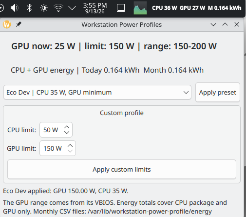

# Fedora Power Profile Manager

Controls power limits for Ryzen CPUs and NVIDIA GPUs on KDE Plasma. It includes preset and custom profiles, live panel readings, and minute-level energy logging.



Install the Fedora dependencies, then run:

```bash
./install.sh
```

Monthly history is stored in CSV files.
